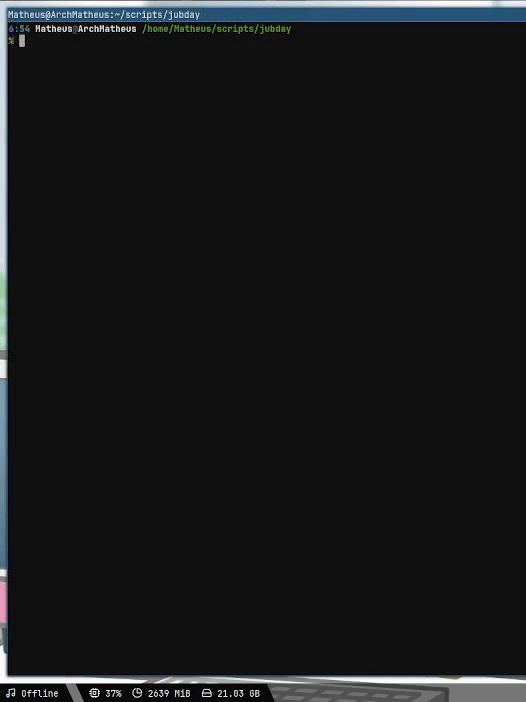

# happy-bday-ju
A bash script that plays a "happy birthday" song with beeps using the PC speakers, along with a message written in C.
It currently works under Linux.

## Getting started
You'll need the [beep](https://man.archlinux.org/man/beep.1.en) package. This package sends signals for the PC speakers to emit a sound: a beep. It can control frequency and duration, which is used for playing the "happy birthday" theme song.

```
sudo pacman -S beep
```

Go to a directory that you wish to have the script, and clone it:
```
git clone https://github.com/matheusfladislau/happy-bday-ju
```

Make sure to unmute the beep sound with a sound mixer (example: ```alsamixer```).

You'll be needing to run the bash script `ju.sh`. This file runs two other files: `happybday.sh` and `message`. `happybday.sh` is a bash script that plays the song using the beep package. The `message` is a C output file that shows the message on the screen.

Make sure that these packages are executable for the user that you'll be using:

```
sudo chmod +x ju.sh happybday.sh message
```

If the user does not have root permissions, you'll need to allow him for `input`
```
sudo usermod -aG input $USER
```

## How to use it

Just run `ju.sh`
```
./ju.sh
```

## Preview

